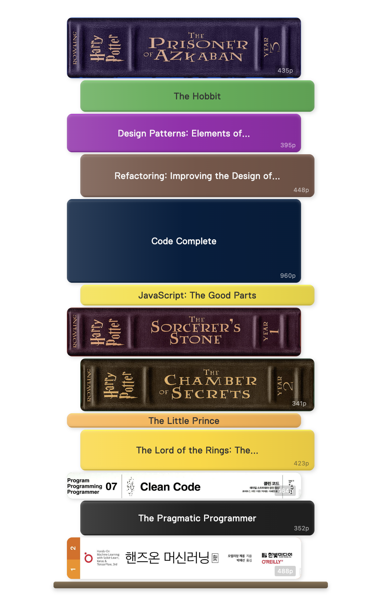

# Read-It Stack

Visualize your reading progress as a beautiful stack of book spines in Obsidian.



## Features

- Visual book spine display based on page count
- Automatic pastel color assignment
- Custom spine colors and images
- Filter by folder, tag, or reading status
- Multiple sorting options
- Click to open book notes
- Responsive design with hover effects

## Installation

### From Obsidian Community Plugins

1. Open Obsidian Settings
2. Go to Community Plugins and disable Safe Mode
3. Click Browse and search for "Read-It Stack"
4. Install and enable the plugin

### Manual Installation

1. Download the latest release from GitHub
2. Extract to your vault's `.obsidian/plugins/read-it-stack/` folder
3. Enable the plugin in Obsidian settings

## Quick Start

1. Create a note for each book with frontmatter:

```yaml
---
title: "Clean Code"
author: "Robert C. Martin"
pages: 464
status: done
---
```

2. Add a code block to display your book stack:

````markdown
```read-it-stack
folder: Books
```
````

## Usage

### Basic Code Block

````markdown
```read-it-stack
```
````

### Filter by Folder

````markdown
```read-it-stack
folder: Books/Fiction
```
````

### Filter by Status

````markdown
```read-it-stack
status: reading
```
````

### Filter by Tag

````markdown
```read-it-stack
tag: fiction
```
````

### Sort and Limit

````markdown
```read-it-stack
status: done
sortBy: dateFinished
sortOrder: desc
limit: 10
```
````

## Code Block Options

| Option | Description | Values | Default |
|--------|-------------|--------|---------|
| `folder` | Filter by folder path | Any path | (all files) |
| `tag` | Filter by tag | Tag name | (none) |
| `status` | Filter by reading status | reading, done, to-read, abandoned | (all) |
| `sortBy` | Sort field | title, pages, dateFinished, rating | title |
| `sortOrder` | Sort direction | asc, desc | asc |
| `limit` | Maximum books to show | Number | (unlimited) |
| `titleFormat` | Custom title template | Template string | {{title}} |

## Frontmatter Fields

| Field | Required | Description | Example |
|-------|----------|-------------|---------|
| `pages` | Yes | Page count (determines spine thickness) | `320` |
| `title` | No | Book title | `"Clean Code"` |
| `author` | No | Author name | `"Robert C. Martin"` |
| `status` | No | Reading status | `reading` |
| `color` | No | Custom spine color | `"#4CAF50"` or `"gold"` |
| `spine` | No | Custom spine image path (see below) | `"[[spine.png]]"` |
| `rating` | No | Your rating | `5` |
| `dateFinished` | No | Completion date | `2024-01-15` |

### Status Values

| Status | Aliases |
|--------|---------|
| `reading` | "reading", "in progress", "in-progress" |
| `done` | "done", "finished", "complete", "completed", "read" |
| `to-read` | "to-read", "to read", "want to read", "tbr" |
| `abandoned` | "abandoned", "dnf" |

### Named Colors

Supported named colors: `red`, `blue`, `green`, `yellow`, `orange`, `purple`, `pink`, `brown`, `gray`, `grey`, `black`, `white`, `gold`, `navy`, `teal`, `maroon`

### Custom Spine Images

You can use custom spine images instead of colored backgrounds:

```yaml
---
title: "Harry Potter"
pages: 309
spine: "[[assets/spines/harry-potter.png]]"
---
```

**Tips for spine images:**
- Use vertical/portrait-oriented images for best results
- Recommended aspect ratio: tall and narrow (matching book spine proportions)
- Supported formats: PNG, JPG, JPEG, WebP
- Store images in your vault (e.g., `assets/spines/` folder)
- Use Obsidian's wiki-link format: `"[[path/to/image.png]]"`

## Title Format Templates

Customize how titles appear on spines:

````markdown
```read-it-stack
titleFormat: {{title}} - {{author}}
```
````

Available variables: `{{title}}`, `{{author}}`, `{{pages}}`, `{{rating}}`, `{{status}}`, `{{filename}}`, `{{dateFinished}}`, `{{tags}}`

## Settings

Configure the plugin in Settings > Read-It Stack:

- **Spine Width**: Width of each book spine (100-400px)
- **Border Radius**: Rounded corners (0-20px)
- **Font Family**: Choose from bundled and system fonts
- **Font Size**: Text size on spines (8-18px)
- **Show Page Count**: Toggle page count display
- **Open in New Tab**: Open book notes in new tab on click

### Thickness Settings

- **Base Thickness**: Minimum spine thickness in pixels
- **Pixels Per Page**: Additional pixels per page
- **Max Thickness**: Maximum spine thickness

## Examples

See the [examples](examples/) folder for:

- [Sample Vault](examples/sample-vault/) - Test vault with 12 sample books
- [Basic Usage](examples/docs/basic-usage.md) - Getting started guide
- [Filtering Options](examples/docs/filtering-options.md) - All filter and sort options
- [Custom Styling](examples/docs/custom-styling.md) - Colors, images, and templates
- [Advanced Queries](examples/docs/advanced-queries.md) - Complex usage patterns


## Development

```bash
# Install dependencies
npm install

# Build
npm run build

# Development mode
npm run dev
```

## License

MIT License

## Contributing

Contributions are welcome! Please feel free to submit a Pull Request.
